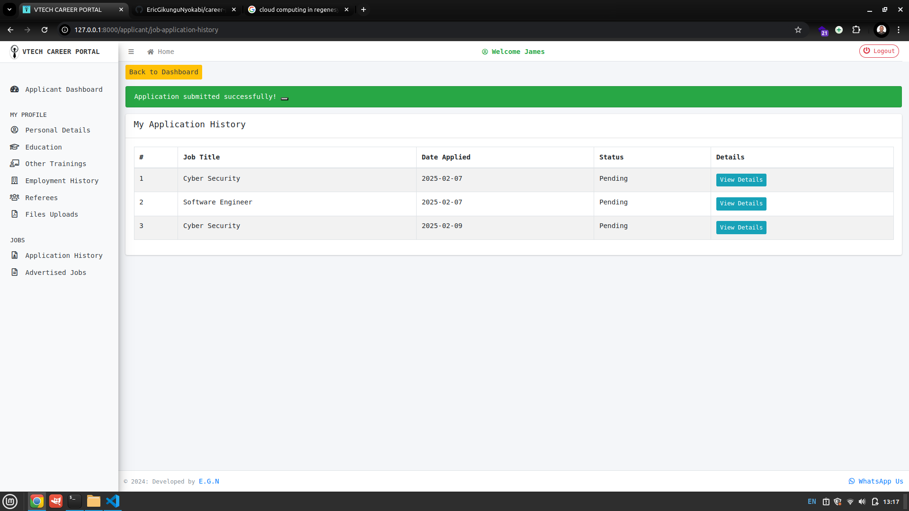

# CAREER PORTAL 

Welcome to my **Career Portal**, a web application designed to streamline job applications and career management for applicants and HR teams. This system allows applicants to create profiles, upload qualifications, browse job listings, and apply for positions.

---
## **Applicant's Layout => Screenshots & Features**
---

### **1. Landing Page (Home)**

- This is the homepage of the Career Portal.
- Users can navigate to the **Login** or **Register** pages.

---

### **2. Login Page**

- Applicants and HR personnel can log in using their credentials.
- New users can register to create an account.

---

### **3. Applicant Dashboard**

- After logging in, applicants are directed to their **dashboard**.
- The dashboard provides quick access to personal details, job applications, and updates.

---

### **4. Personal Profile**

- Applicants can update their **personal information** such as name, address, phone number, and other contact details.

---

### **5. Education Background**

- Users can add their **education qualifications** including degree, institution, and years of study.

---

### **6. Other Trainings & Certifications**

- This section allows applicants to enter any additional **certifications or professional training**.

---

### **7. Advertised Jobs**

- The job listings page displays **all active job postings**.
- Users can click on a job title to view its details and requirements.

---

### **8. Job Application**

- Applicants can submit applications directly through the portal.
- Required documents such as CVs or cover letters can be uploaded.

---

### **9. Job Application History**

- This section keeps track of all **previous job applications** submitted by the user.
- Applicants can check the **status** of each application (e.g., pending, accepted, rejected).

---

---
## **Human Resource (HR) Layout => Screenshots & Features**
---
### **1. HR Dashboard**

- This is the HR-Dashboard of the Career Portal.
- HR Can get a simplified view of Total no of applicants, Jobs Posted, Total Applicants required and Job posting per category.
---

### **2. All Applicants List**

---

### **3. Single Applicants View**

---

### **4. View / Edit / Create Job Posting**

---

### **5. Create Job Posting**

---

### **6. Edit Job Posting**

---

---
## **Management Board Layout => Screenshots & Features**
---

---
## **Admin Screenshots Layout => & Features**
---